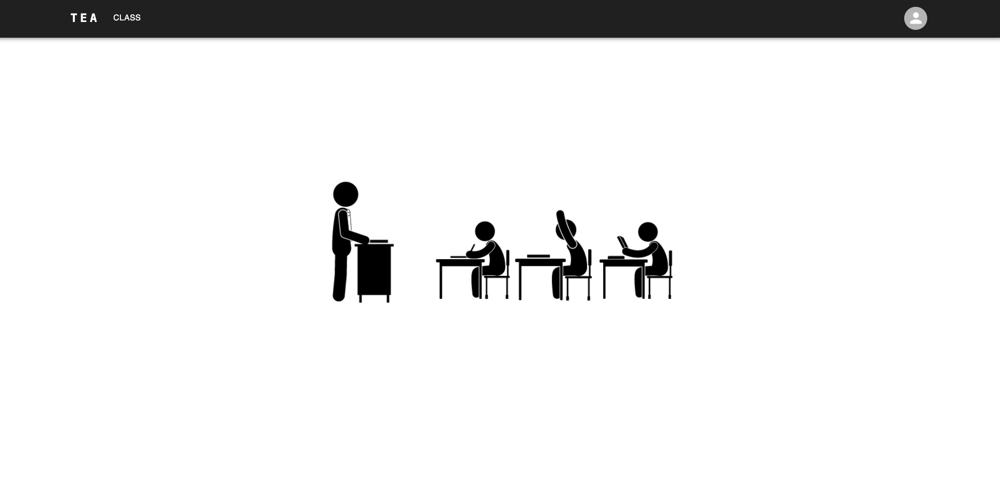
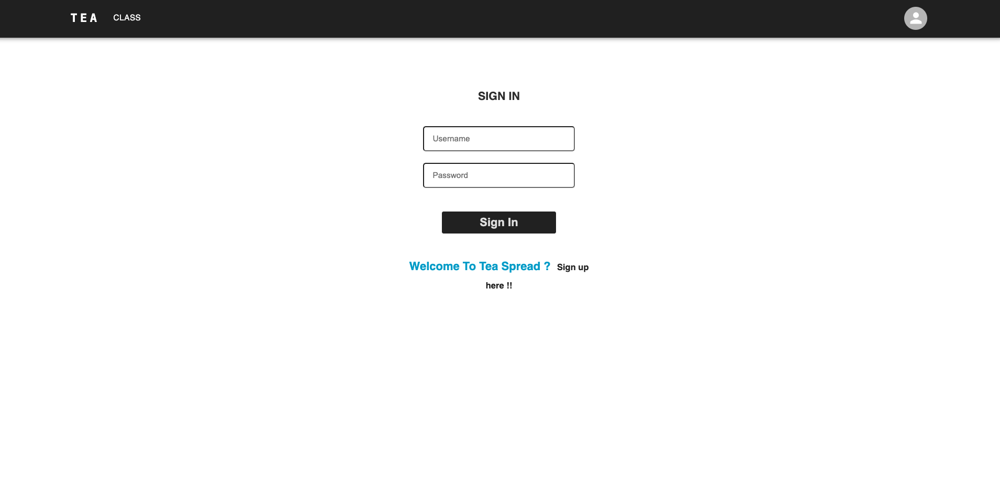
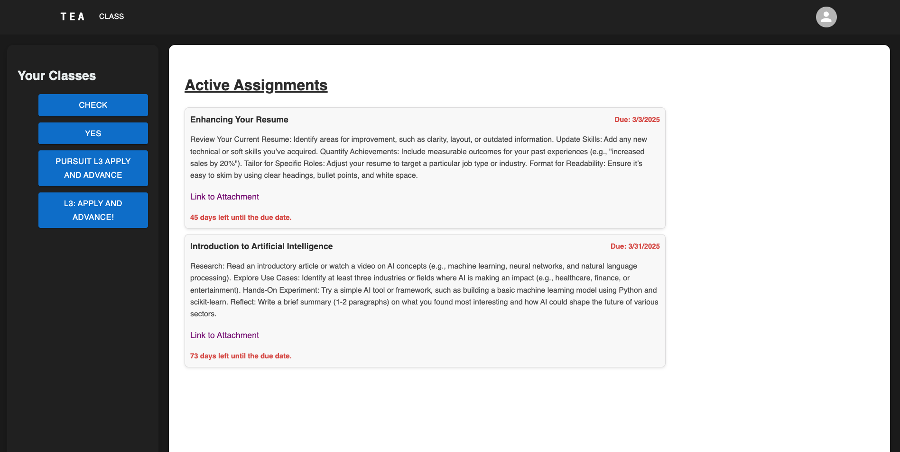

# Tea-Spread

Tea-Spread is a comprehensive web application designed to streamline class management for both teachers and students. It offers tools for creating, submitting, and grading assignments, along with class enrollments and user profile management, providing an organized and efficient platform for educators and learners alike.

## Key Features

- **User Profiles**: Teachers and students can manage and update their profiles.
- **Assignments Management**: Teachers create assignments, while students can submit and track them.
- **Class Enrollment**: Teachers can add or remove classes, and students can join using a class code.
- **Notifications**: Real-time updates about assignments and class activities (Currently a work in progress).

## Technologies

- **Frontend**: React, JavaScript, CSS, Material UI, HTML
- **Backend**: Node.js, Express, Passport.js, REST APIs
- **Database**: PostgreSQL, SQL
- **Deployment**: Netlify, Render
- **Version Control**: Git, GitHub
- **Authentication**: Passport.js

## Setup Instructions

1. Clone the repository:

   ```bash
   git clone https://github.com/toplouie1/Tea-Spread.git
   ```

   ```bash
   npm install
   ```

   ```bash
   npm start
   ```




